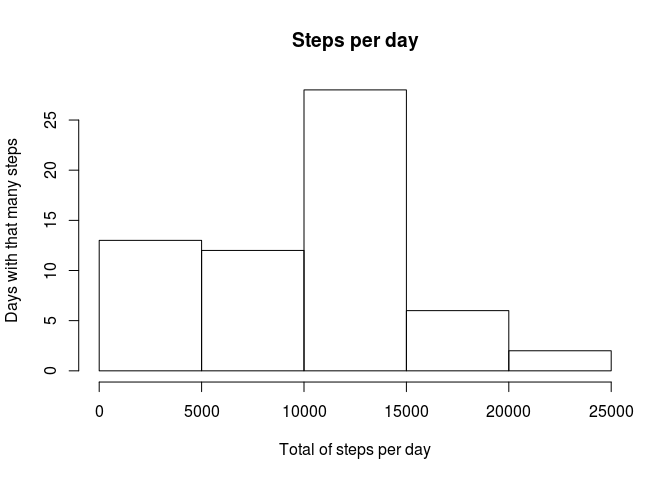
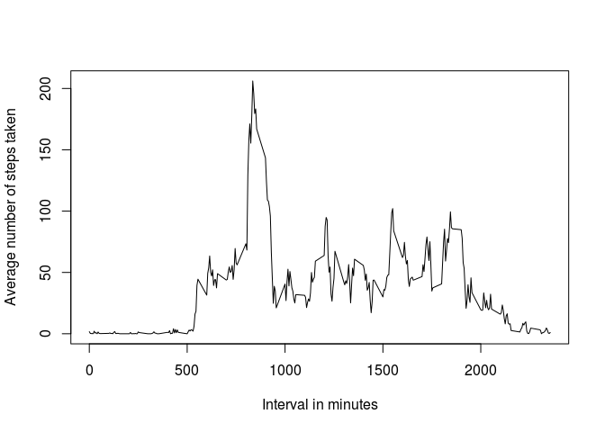
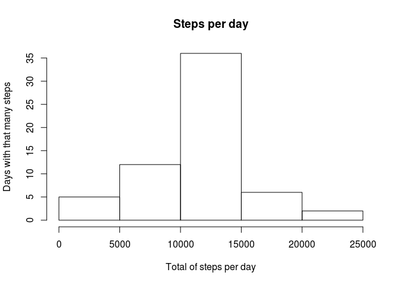
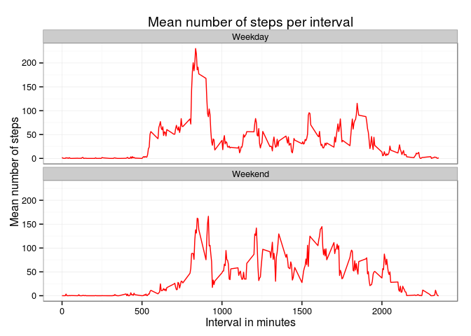

# Reproducible Research: Peer Assessment 1
Timo Grossenbacher  
06/04/2015  


## Loading and preprocessing the data


```r
steps <- read.csv("activity.csv")
# steps[is.na(steps$steps),]$steps <- 0
table(steps$steps == 0)
```

```
## 
## FALSE  TRUE 
##  4250 11014
```


## What is mean total number of steps taken per day?


```r
# histogram of steps per day
stepsPerDay <- steps %>%
  group_by(date) %>%
  summarize(sumSteps = sum(steps, na.rm = T))
hist(stepsPerDay$sumSteps, main = "Steps per day", xlab = "Total of steps per day", ylab = "Days with that many steps")
```

 

```r
# mean of total number of steps per day
mean(stepsPerDay$sumSteps)
```

```
## [1] 9354.23
```

```r
# median
median(stepsPerDay$sumSteps)
```

```
## [1] 10395
```


## What is the average daily activity pattern?

```r
stepsPerInterval <- steps %>%
  group_by(interval) %>%
  summarize(meanSteps = mean(steps, na.rm = T))
plot(stepsPerInterval$meanSteps ~ stepsPerInterval$interval, type = "l", xlab = "Interval in minutes", ylab = "Average number of steps taken")
```

 

```r
# which interval, across all days, contains the maximum average steps taken? 
stepsPerInterval[which(stepsPerInterval$meanSteps == max(stepsPerInterval$meanSteps)),]
```

```
## Source: local data frame [1 x 2]
## 
##   interval meanSteps
## 1      835  206.1698
```


## Imputing missing values


```r
# copy original data frame
filled_steps <- steps 
# 1
cc <- table(complete.cases(steps))
names(cc) <- c("missing", "complete")
cc
```

```
##  missing complete 
##     2304    15264
```

```r
# 2 -> replace NAs with meanSteps in the respective interval
# kinda ugly but seems to work
lookupMean <- function(x){
  if(is.na(x$steps)){
    return(stepsPerInterval[stepsPerInterval$interval == x$interval,]$meanSteps)
  } else {
    return(x$steps)
  }
}
filled_steps$steps <- as.double(by(steps, 1:nrow(steps), lookupMean))
table(is.na(filled_steps$steps)) # no more missing values
```

```
## 
## FALSE 
## 17568
```

```r
# 4
# histogram of steps per day
filledStepsPerDay <- filled_steps %>%
  group_by(date) %>%
  summarize(sumSteps = sum(steps))
hist(filledStepsPerDay$sumSteps, main = "Steps per day", xlab = "Total of steps per day", ylab = "Days with that many steps")
```

 

```r
# mean of total number of steps per day
mean(filledStepsPerDay$sumSteps)
```

```
## [1] 10766.19
```

```r
# median
median(filledStepsPerDay$sumSteps)
```

```
## [1] 10766.19
```
It seems that the distribution of steps taken per day looks a bit more "gaussian" or "normal" now.
The distribution is not skewed anymore, as can also be seen in the mean being equal to the median. 
Both mean and median are a bit higher than in the data set with missing values still contained.


## Are there differences in activity patterns between weekdays and weekends?


```r
filled_steps$day <- as.factor(ifelse(weekdays(as.Date(filled_steps$date, format = "%Y-%m-%d")) == "Sunday" | weekdays(as.Date(filled_steps$date, format = "%Y-%m-%d")) == "Saturday", "Weekend", "Weekday"))

# average by interval, grouped by weekday-type
filledStepsPerInterval <- filled_steps %>%
  group_by(interval, day) %>%
  summarize(meanSteps = mean(steps, na.rm = T))

ggplot(aes(interval, meanSteps), data = filledStepsPerInterval) + 
  geom_line(color = "red") +
  facet_wrap( ~ day, nrow = 2) +
  theme_bw() +
  labs(title = "Mean number of steps per interval",
       y = "Mean number of steps",
       x = "Interval in minutes") 
```

 

Overall, it looks that more steps are taken during the weekend, but they are more uniformly distributed over the day - whereas, during weekdays, the peak during the morning hours is more pronounced than on weekends. It also starts earlier, suggesting the person sleeping in on weekends.
